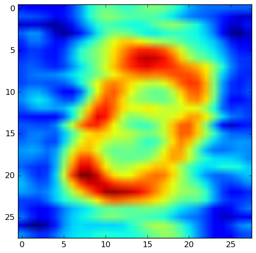

# holographic_memory
Example of [Holographic Reduced Representations](http://www.ijcai.org/Proceedings/91-1/Papers/006.pdf) in Tensorflow

## Input Image
This is one of the original images we want to encode via [Holographic Reduced Representations](http://www.ijcai.org/Proceedings/91-1/Papers/006.pdf)

## Reconstruction
A reconstruction using multiple memory traces

