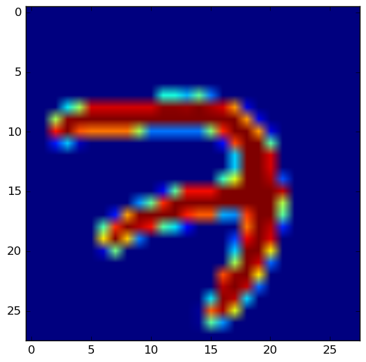
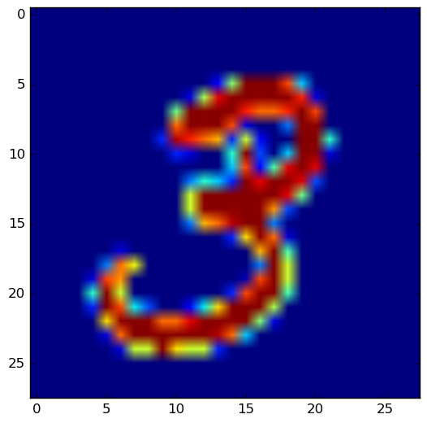
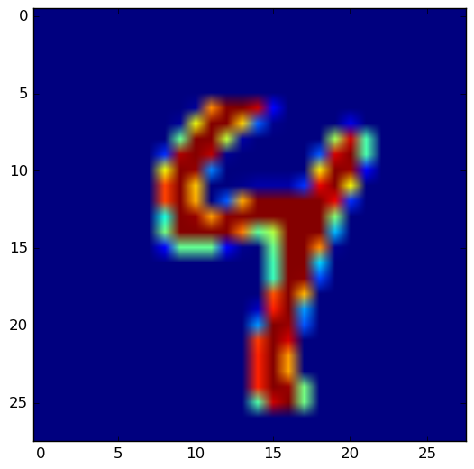
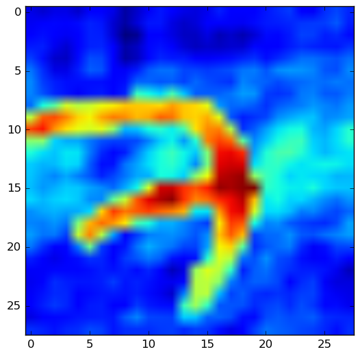
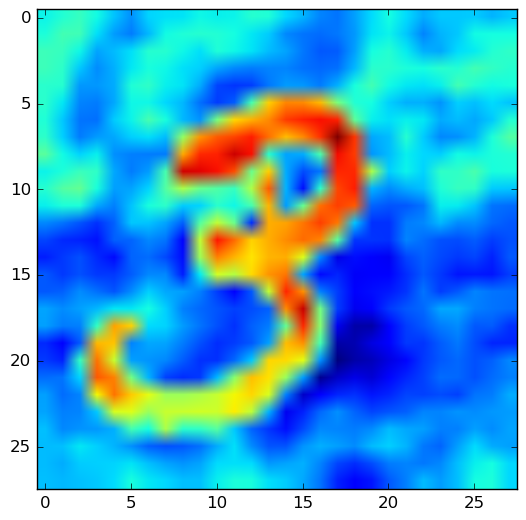
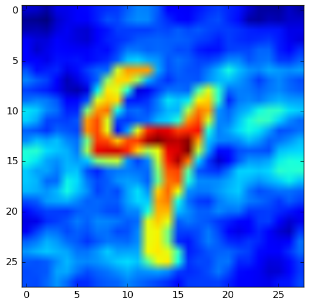

# holographic_memory
Implementation of [Holographic Reduced Representations](http://www.ijcai.org/Proceedings/91-1/Papers/006.pdf) in Tensorflow

## Requirements
Code is currently for python2 and requires the following dependencies:

  - numpy
  - sklearn
  - tensorflow
  - matplotlib

### Usage
```
python run_mnist_example.py # See file for possible flags
```

### Flags
Flags are defined [here](https://github.com/jramapuram/blob/master/run_mnist_example.py#L16-L27) for the mnist example.

## Input Images
Listed below are the original images from a minibatch size of 3





## Reconstruction
Listed below is the reconstruction of the original 3 images using a memory of 20 traces:




